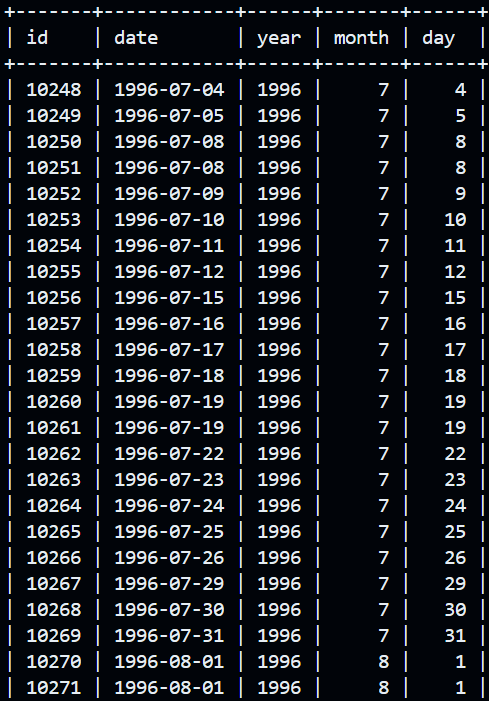
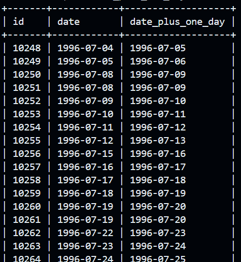
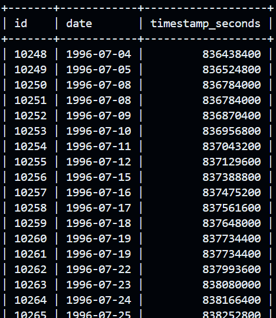
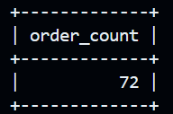
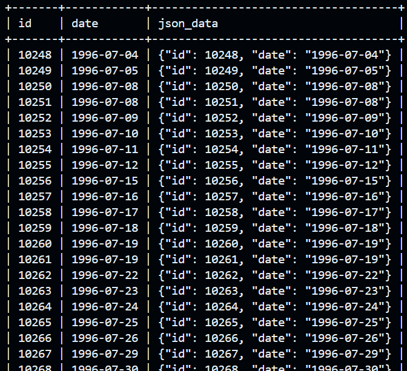

# goit-rdb-hw-07

### Завдання 1

```sql
SELECT 
    id,
    date,
    YEAR(date) AS year,
    MONTH(date) AS month,
    DAY(date) AS day
FROM orders;
```



---

### Завдання 2

```sql
SELECT 
    id,
    date,
    DATE_ADD(date, INTERVAL 1 DAY) AS date_plus_one_day
FROM orders;
```



---

### Завдання 3

```sql
SELECT 
    id,
    date,
    UNIX_TIMESTAMP(date) AS timestamp_seconds
FROM orders;
```



---

### Завдання 4

```sql
SELECT COUNT(*) AS order_count
FROM orders
WHERE date BETWEEN '1996-07-10 00:00:00' AND '1996-10-08 00:00:00';
```



---

### Завдання 5

```sql
SELECT 
    id,
    date,
    JSON_OBJECT('id', id, 'date', date) AS json_data
FROM orders;
```

